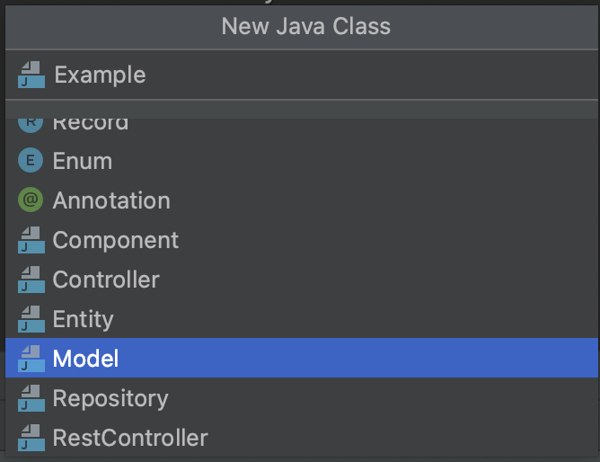

## Most Useful Live Template and Inspections 

### Importing Settings

- Choose File | Manage IDE Settings | Import Settings from the menu.
- Specify the path to the archive with the exported live template configuration.
- In the Import Settings dialog, select the Live templates checkbox and click OK.
- After restarting IntelliJ IDEA, you will see the imported live templates on the Editor | Live Templates page of the IDE settings ⌘ ,.

### Which Ones Are Live Templates ?

#### Create New Component 
- Choose Package | New | Java Class from the menu.
- Choose Component from the popup.
- Set component name input from the popup. (*Class name is not case sensitive. if you are write 'example' then class name is 'Example.class'*) 

- Result =>

#### Create New Entity 
- Choose Package | New | Java Class from the menu.
- Choose Entity from the popup.
- Set entity name input from the popup. (*Class name is not case sensitive. if you are write 'example' then class name is 'Example.class'*)

- Result =>

#### Create New Repository Interface
- Choose Package | New | Java Class from the menu.
- Choose repository from the popup.
- Set **entity name** input from the popup. 
(*Class name is not case sensitive. if you are write 'example' or 'exampleRepository' or 'Example' then class name is 'ExampleRepository.class'*)

- Result =>

#### Create New Service Interface 
- Choose Package | New | Java Class from the menu.
- Choose service from the popup.
- Set **entity name** input from the popup. 
(*Class name is not case sensitive. if you are write 'example' or 'exampleService' or 'Example' then class name is 'ExampleService.class'*)

- Result =>

#### Create New ServiceImpl  
- Choose Package | New | Java Class from the menu.
- Choose ServiceImpl from the popup.
- Set **entity name** input from the popup. 
(*Class name is not case sensitive. if you are write 'example' or 'exampleService' or 'Example' then class name is 'ExampleServiceImpl.class'*)

- Result =>

#### Create New Controller  
- Choose Package | New | Java Class from the menu.
- Choose Controller from the popup.
- Set **entity name** input from the popup. 
(*Class name is not case sensitive. if you are write 'example' or 'exampleController' or 'Example' then class name is 'ExampleController.class'*)

- Result =>

#### Create New RestController  
- Choose Package | New | Java Class from the menu.
- Choose RestController from the popup.
- Set **entity name** input from the popup. 
(*Class name is not case sensitive. if you are write 'example' or 'exampleController' or 'Example' then class name is 'ExampleController.class'*)

- Result =>

#### Create New DTO Model  
- Choose Package | New | Java Class from the menu.
- Choose Model from the popup.
- Set dTO name input from the popup. 
(*Class name is not case sensitive. if you are write 'example' then class name is 'Example.class'*)

- Result =>

#### *Extras Angular Service Create
- Choose Package | New | Ts-Service from the menu.
- Set file name and api from the popup input 

- Result =>

### Which Ones Are Live Templates Moreee... ?

#### Create New GetMapping in Controller
- if write 'getmapping' in controller then return ;

#### Create New PostMapping in Controller
- if write 'postmapping' in controller then return ;

#### Create New Private Void Method in Class
- if write 'prm-v' in Class then return ;

#### Create New Public Void Method in Class
- if write 'pubm-v' in Class then return ;
  

#### Create New Public Return Method in Class
- if write 'pubm' in Class then return ;
  

#### Create New If Null Check Statement in Method
- if write 'ifn' in Method then return ;

#### Create New If Not Null Check Statement in Method
- if write 'inn' in Method then return ;
  

#### Create New Angular Component Or Than Ones More
  

